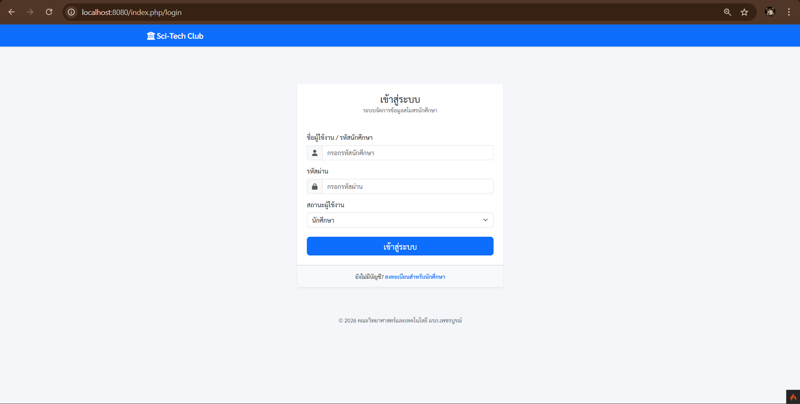
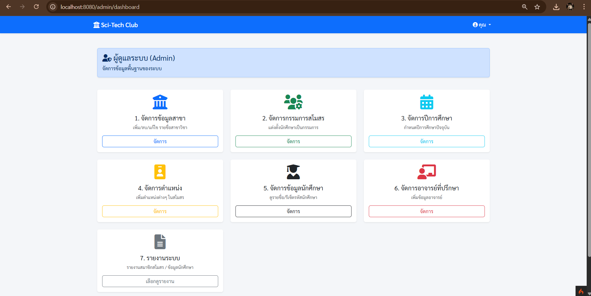
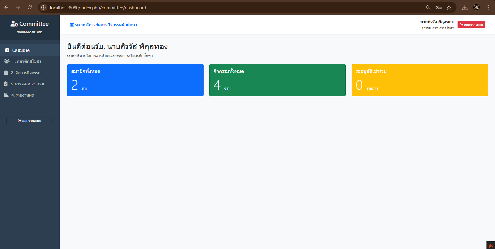
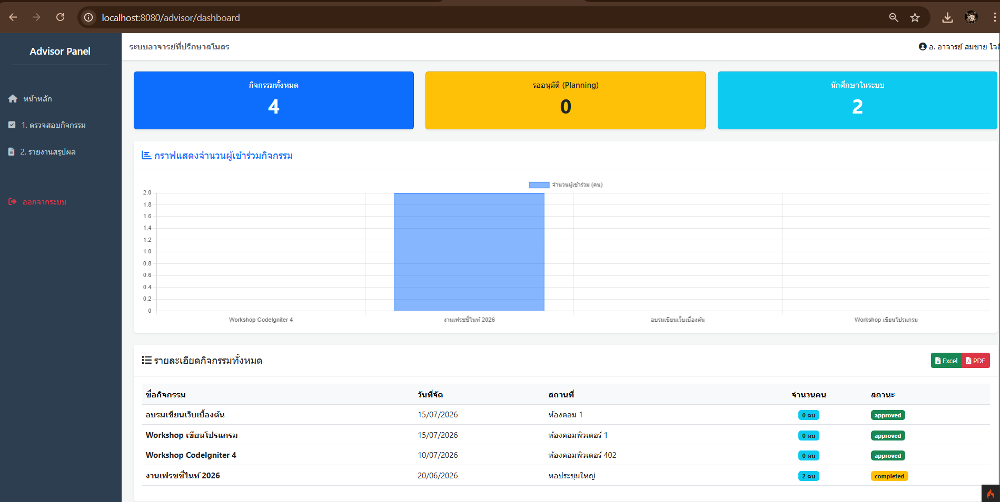
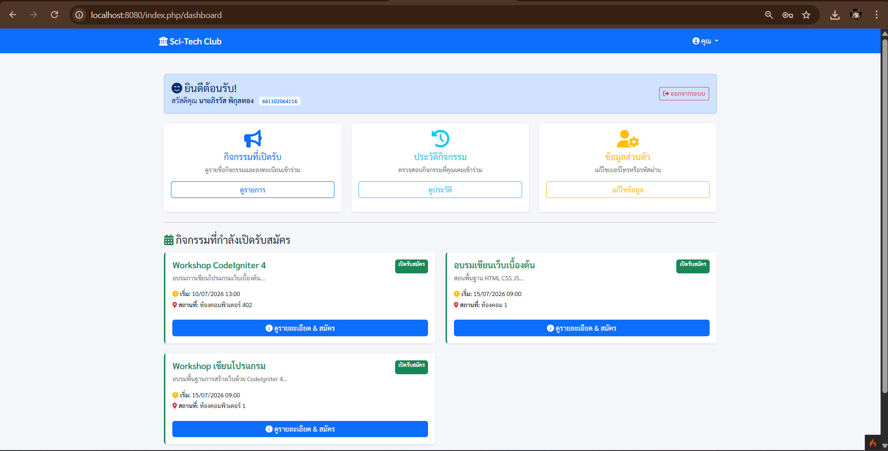

# 🎓 Sci-Tech Club Management System 
**ระบบบริหารจัดการกิจกรรมสโมสรนักศึกษา คณะวิทยาศาสตร์และเทคโนโลยี**

[](https://codeigniter.com/)
[](https://php.net/)
[](https://getbootstrap.com/)

โปรเจค Web Application สำหรับบริหารจัดการกิจกรรมสโมสรนักศึกษา พัฒนาด้วยสถาปัตยกรรม MVC (Model-View-Controller) ช่วยให้การดำเนินงานของสโมสรฯ เป็นระบบมากขึ้น ตั้งแต่การเสนอโครงการ การอนุมัติ การเปิดรับสมัคร ไปจนถึงการเช็คชื่อและการออกรายงานสรุปผล

---

## ✨ ฟีเจอร์หลัก (Key Features)

ระบบถูกออกแบบมาให้รองรับผู้ใช้งาน 4 บทบาท (Role-Based Access Control) ดังนี้:

* **🛠 ผู้ดูแลระบบ (Admin):** จัดการข้อมูลพื้นฐาน (สาขา, ปีการศึกษา), จัดการผู้ใช้งาน และแต่งตั้งคณะกรรมการสโมสร
* **📋 คณะกรรมการสโมสร (Committee):** สร้างกิจกรรม, จัดการระบบเช็คชื่อ, และดู Dashboard สรุปสถิติผู้เข้าร่วมกิจกรรม
* **👨‍🏫 อาจารย์ที่ปรึกษา (Advisor):** ตรวจสอบและพิจารณาอนุมัติ/ปฏิเสธ กิจกรรมที่คณะกรรมการเสนอ
* **🎓 นักศึกษา (Student):** ดูรายการกิจกรรมที่เปิดรับสมัคร, กดสมัครเข้าร่วม, และตรวจสอบประวัติกิจกรรมของตนเอง

---

## 📸 ภาพหน้าจอการใช้งาน (Screenshots)

### หน้าเข้าสู่ระบบ (Login)


### มุมมองผู้ดูแลระบบ (Admin Dashboard)


### มุมมองคณะกรรมการ (Committee Dashboard)


### มุมมองอาจารย์ที่ปรึกษา (Advisor Dashboard)


### มุมมองนักศึกษา (Students Dashboard)


---

## 💻 Server Requirements & Tech Stack

* **PHP:** Version 8.2 or higher (required extensions: `intl`, `mbstring`, `json`, `mysqlnd`)
* **Framework:** CodeIgniter 4
* **Frontend:** HTML5, Bootstrap 5, FontAwesome
* **Database:** MySQL / MariaDB

---

## 🚀 วิธีการติดตั้งและทดลองรัน (Installation Guide)

1. **Clone โปรเจคลงเครื่อง:**
   ```bash
   git clone [https://github.com/areglk12345-spec/Cs_club.git](https://github.com/areglk12345-spec/Cs_club.git)
   cd Cs_club